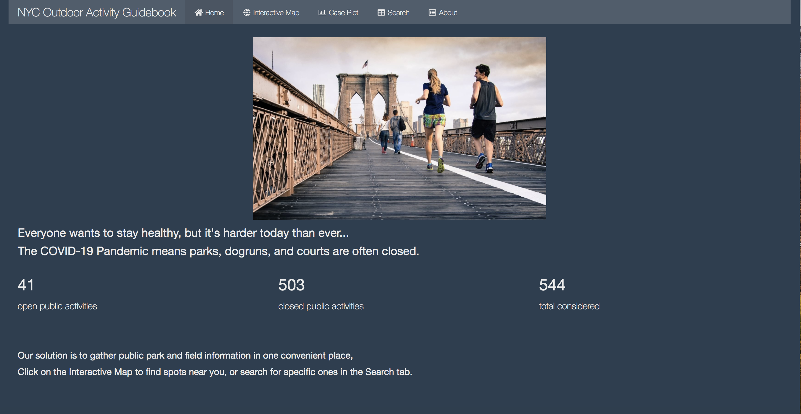
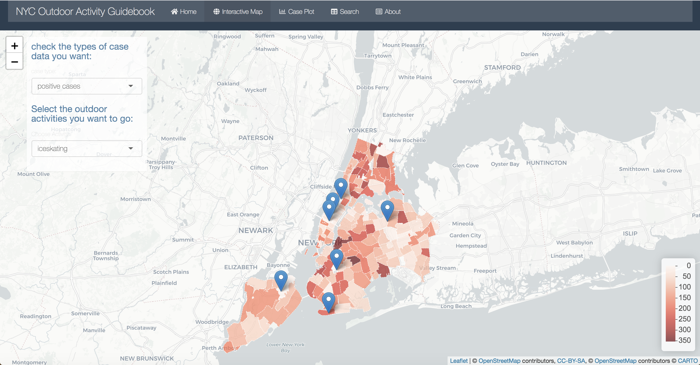
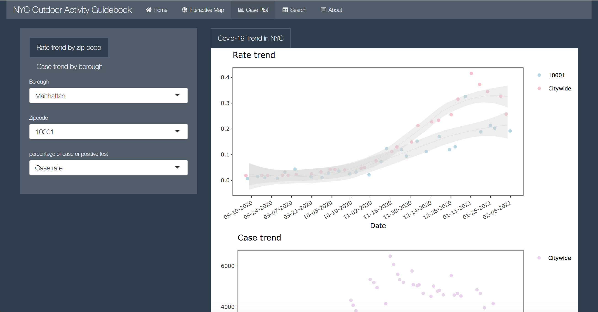
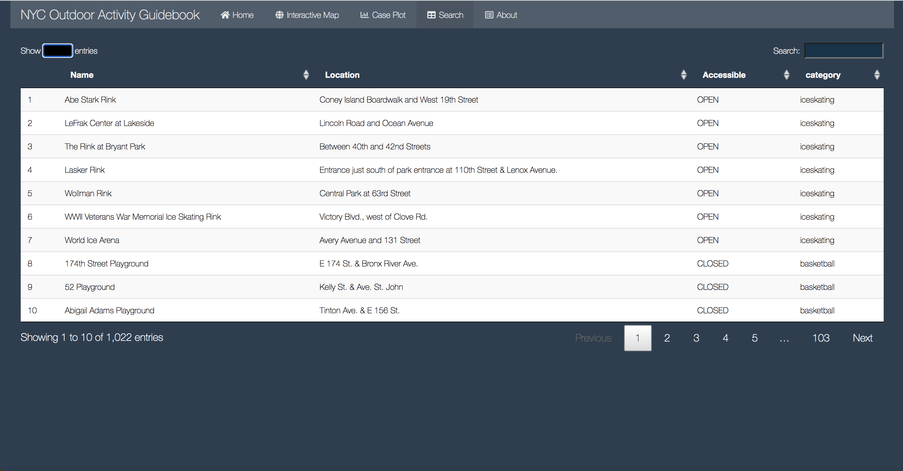

## Project 2: NYC Outdoor Activities Guidebook with Shiny App
Term: Spring 2021

### [Project Description](doc/project2_desc.md)







+ Team # Group 3
+ [Click Here to See the Shiny App](https://aiokic.shinyapps.io/gr5243p2g3/)
+ Team members
	+ team member 1: Ai, Haosheng
	+ team member 2: Chen, Ellen
	+ team member 3: Harris, Sean
	+ team member 4: He, Changhao
	+ team member 5: Pan, Yushi 

+ **Project summary**: Are you facing with the negative psychological effects of quarantine at home during the Covid? What about doing some outdoor activities! We provide a shiny dashborad of displaying places of NYC outdoor activities under the current pandemic. We hope outdoor activities could help you get rid of the post-traumatic stress symptoms! The interactive map page will give you distributions of activities in NYC. You can filter by choosing specific borough or zipcode to narrow your search. Since the pandemic does not end, we also provide time series trend plots for you to see the current and past confirmed cases and decide whether to go for the outdoor activities by yourself. Last but not least, we strongly recommend you to follow the New York City's Localized Restriction and Guidelines and do not forget to maintain at least 6ft social distancing while you are outside. 

+ **Contribution statement**: ([default](doc/a_note_on_contributions.md)) All team members contributed equally in all stages of this project. All team members approve our work presented in this GitHub repository including this contributions statement. 

**Haosheng Ai**: Produced NYC coronavirus cases map by extracting  and combining data from data-by-modzcta.csv, casebyzipcode.csv and geo_data.RData.

**Ellen Chen**: Did data cleaning and manipulation for last7days-by-modzcta.csv, covid_cases_dataset.csv, zip_code_database.csv and group-cases-by-boro.csv; contributed to the global.R file.

**Sean Harris**: Created model prediction, search and data table function, and Home page. Contributions to map and plot visualization.

**Changhao He**: Extracted and cleaned caserate-by-modzcta.csv, percentpositive-by-modzcta.csv and now-cases-by-day.csv from the coronavirus-data github, then made the rate trend plot and case trend plot.

**Yushi Pan**: Contributed outdoor activity part of the map, combined it with Haosheng's covid cases map. Contributed the global file, User Interface, Home and About page design. 

Following [suggestions](http://nicercode.github.io/blog/2013-04-05-projects/) by [RICH FITZJOHN](http://nicercode.github.io/about/#Team) (@richfitz). This folder is orgarnized as follows.

```
proj/
├── app/
├── lib/
├── data/
├── doc/
└── output/
```

Please see each subfolder for a README file.

